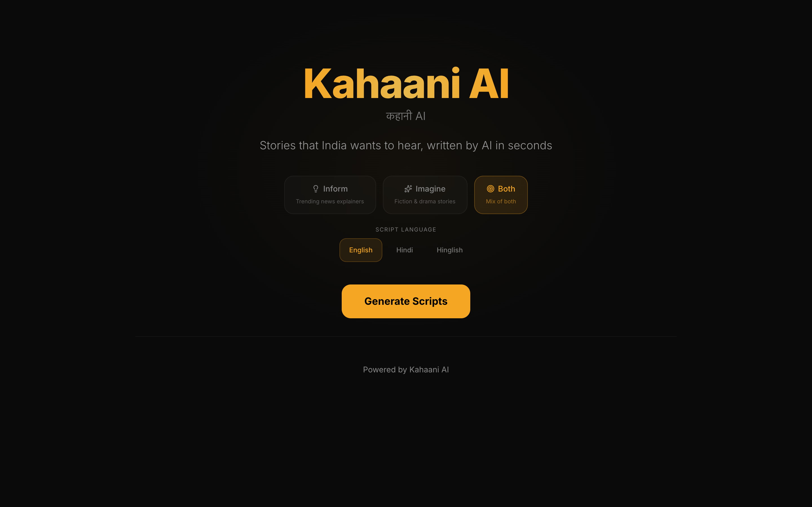
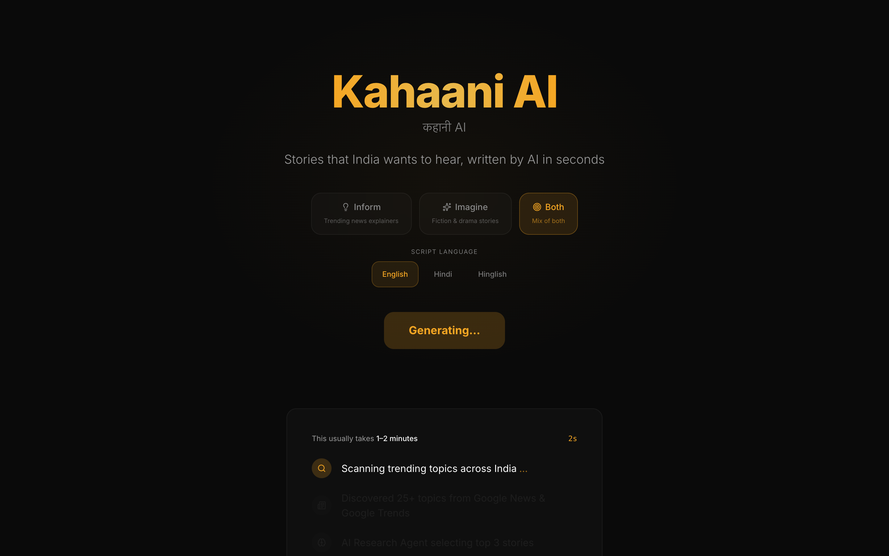
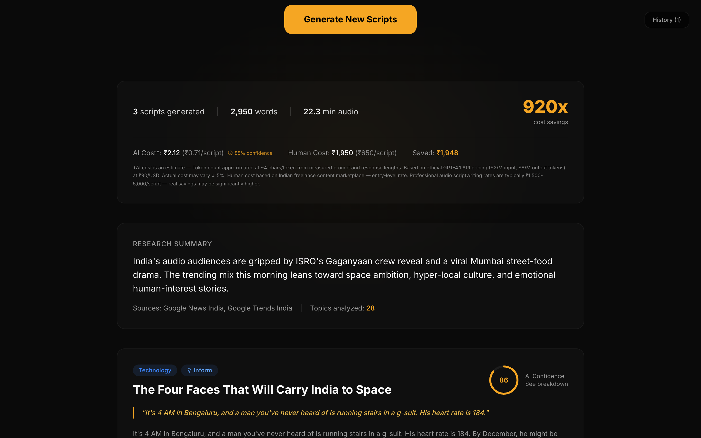
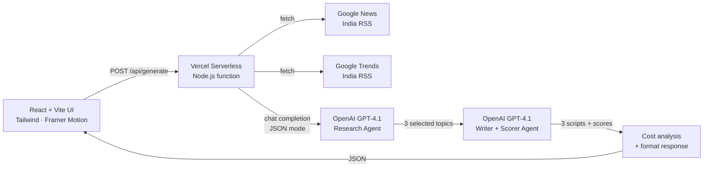

<div align="center">

# Kahaani AI

**An AI agent that generates 3 publication-ready audio scripts in 90 seconds — for ₹2 instead of ₹2,000.**

[](https://kahaani-ai-livid.vercel.app)
[](LICENSE)
[](#tech-stack)

[**→ Try the live demo**](https://kahaani-ai-livid.vercel.app)

</div>

---

## What this is

A 4-day proof-of-concept built to demonstrate how **AI agents can replace the bottleneck in audio content production** for the Indian streaming market.

Pick a mode (Inform / Imagine / Both) and a language (English / Hindi / Hinglish). Hit generate. 90 seconds later, you have three full-length audio scripts (800–1200 words each), a research summary of trending Indian topics, AI confidence scores, and a transparent cost breakdown.

This is a working product, not a deck. Open the live link and try it.

## Screenshots

<table>
<tr>
<td width="33%"></td>
<td width="33%"></td>
<td width="33%"></td>
</tr>
<tr>
<td align="center"><sub>Pick mode + language</sub></td>
<td align="center"><sub>Staged loading (Research → Write → Score)</sub></td>
<td align="center"><sub>3 scripts + cost analysis</sub></td>
</tr>
</table>

## The numbers

| Metric | AI (this app) | Human freelancer | Delta |
|---|---|---|---|
| **Cost for 3 scripts** | **₹2.12** | ₹1,950 | **920× cheaper** |
| **Turnaround** | **~90 seconds** | 2–3 days | ~2,500× faster |
| **Output volume** | 22 minutes of audio per generation | — | — |
| **Confidence transparency** | AI self-scores hook, narrative, emotion, audio-readiness | Subjective | — |

Cost basis: GPT-4.1 official pricing ($2/M input, $8/M output) × measured prompt/response lengths × ₹90/USD. Human rate: Indian freelance content marketplace (Pepper Content, Fiverr India). All numbers are reproducible from the [`api/generate.js`](api/generate.js) cost-tracking logic.

## Architecture



Two-agent design: a **Research Agent** picks the three highest-potential topics from ~30 trending Indian news + search items, and a **Writer Agent** turns each into a 800-1200 word script with self-rated confidence scores. The frontend renders a staged loading animation that mirrors each pipeline stage.

A 15-topic curated fallback kicks in if the RSS feeds return fewer than 5 items, so the demo never dead-ends on a recruiter.

## Tech stack

| Layer | Choice | Why |
|---|---|---|
| Frontend | **React 18 + Vite** | Fastest path to a polished SPA. Vite's dev experience is unmatched for portfolio work. |
| Styling | **Tailwind CSS** | Dark, premium aesthetic without writing CSS. Glass-morphism cards, custom gold accent. |
| Animation | **Framer Motion** | Staged loading transitions and AnimatePresence for smooth result reveals. |
| Icons | **Lucide React** | Consistent SVG icon system. Zero emojis on the page. |
| Backend | **Vercel Serverless (Node.js)** | One-file backend. No infra to manage. Auto-scales. |
| AI | **OpenAI GPT-4.1** with `response_format: json_object` | Reliable structured output. Eliminates regex fallback parsing. |
| Hosting | **Vercel** | Auto-deploy from `main`. Edge network. 180s function budget. |

## Engineering decisions worth calling out

1. **Two-agent split, not one.** A single prompt asking "pick topics + write scripts" produces shallow output. Splitting into Research Agent (picks 3 topics with rationale) → Writer Agent (writes 800-1200 words each with self-scoring) yields markedly better quality and gives the UI an honest reason to show staged progress.

2. **JSON mode + per-call timeouts.** GPT-4.1's `response_format: json_object` removes the need for regex-based parsing of markdown-fenced responses. Each OpenAI call has a 75s `AbortController` timeout so a single slow call can't consume the entire 180s Vercel function budget. ([`api/generate.js:243`](api/generate.js#L243))

3. **RSS fallback strategy.** Google News/Trends RSS occasionally returns sparse results from Vercel's edge regions. The function falls through to 15 curated India-relevant topics when total feed items < 5, so the demo never silently degrades. ([`api/generate.js:11`](api/generate.js#L11))

4. **Topic deduplication via localStorage.** Each generation's topics are cached client-side and sent as `exclude_topics` on subsequent calls, so repeated generations never produce overlapping scripts. ([`src/lib/history.js`](src/lib/history.js))

5. **Cost transparency, with confidence levels.** The cost analysis surface shows AI cost (₹), human cost (₹), savings multiplier — and an "85% confidence" badge with a footnote explaining the ±15% variance window from token-to-character estimation. Honest framing matters more than impressive numbers.

## Run locally

```bash
git clone https://github.com/aksheyw/kahaaniAI.git
cd kahaaniAI
npm install

# Add your OpenAI key
echo "OPENAI_API_KEY=sk-your-key-here" > .env

# Start the Vercel dev server (runs both Vite + serverless functions)
npx vercel dev
# OR for frontend-only with a custom backend:
# echo "VITE_API_URL=https://your-backend.example.com" >> .env.local
# npm run dev
```

Visit `http://localhost:3000` (Vercel dev) or `http://localhost:5173` (Vite dev).

## Deploy your own

1. Fork this repo.
2. Import into Vercel — it auto-detects Vite + the `api/` folder.
3. Add one environment variable: `OPENAI_API_KEY`.
4. (Optional) `ALLOWED_ORIGIN` to lock down CORS to your domain.
5. Push to `main` — Vercel auto-deploys.

The free tier doesn't support 180s function timeouts; use Vercel Pro or reduce `max_tokens` in [`api/generate.js`](api/generate.js) to fit within 60s.

## Project structure

```
kahaani-landing/
├── api/
│   ├── generate.js      # Vercel serverless function — full pipeline in 290 lines
│   └── health.js        # /api/health — deployment liveness check
├── src/
│   ├── App.jsx          # Top-level state, generation flow, history management
│   ├── components/
│   │   ├── Hero.jsx              # Mode + language selectors
│   │   ├── LoadingStages.jsx     # Animated 5-stage progress
│   │   ├── ResultsSummary.jsx    # Cost + totals strip
│   │   ├── ScriptCard.jsx        # Per-script card with expandable script text
│   │   ├── ConfidenceScore.jsx   # Circular score + breakdown
│   │   └── HistoryDrawer.jsx     # localStorage history with restore
│   └── lib/history.js            # Persistent topic dedup + history
├── docs/
│   ├── architecture.md           # Engineering deep-dive
│   └── screenshots/              # Embedded above
└── vercel.json          # Function config — 180s timeout
```

## What I learned shipping this

A few notes from the build that future-me (and forkers) will appreciate:

- **Vercel `maxDuration` matters.** Free tier caps at 60s. GPT-4.1 with 8000 max_tokens routinely takes 90–120s for the writer call alone. I'm on Pro for the demo; the README documents the workaround for free-tier deployers.
- **Framer Motion's `initial={{ opacity: 0 }}` won't fire on background tabs.** Cosmetic only — never affects real users — but it tripped up automated visual testing.
- **Mobile responsive on a Motorola Razr (280px outer display) was the hardest viewport.** Solved with `flex-wrap` on button rows, `flex-col sm:flex-row` on data rows, and 44px+ touch targets via `py-3` on language pills.
- **OpenAI JSON mode requires a system message that mentions "JSON".** Without it, the API errors out. Documented in the OpenAI changelog but easy to miss.
- **Token cost estimation via character count has a ±15% variance.** I disclose this in the UI rather than pretending the number is exact. Honest is better than impressive.

## License

[MIT](LICENSE) — © 2026 Akshey Walia

---

<div align="center">

**Built by [Akshey Walia](https://www.linkedin.com/in/aksheywalia/)** · [LinkedIn](https://www.linkedin.com/in/aksheywalia/) · [aksheywalia.in](https://aksheywalia.in)

*Director-level Product Manager. I build products that ship.*

</div>
